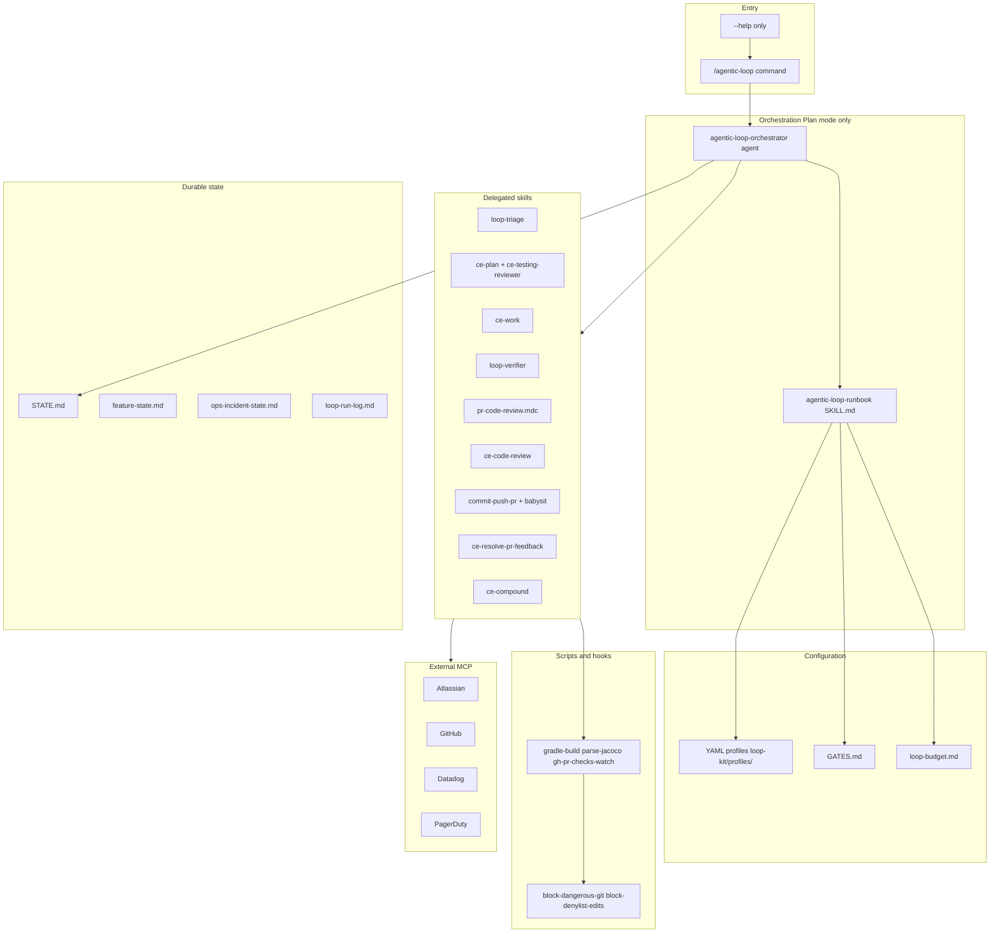
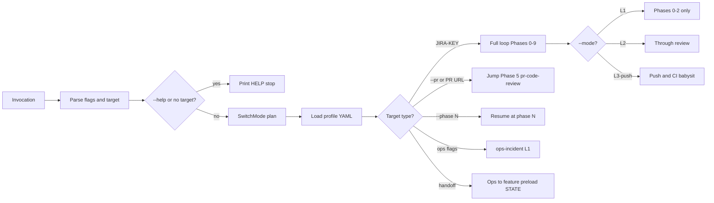
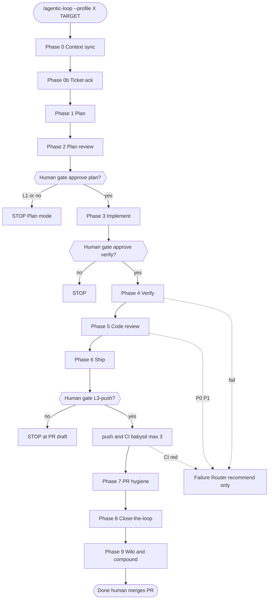
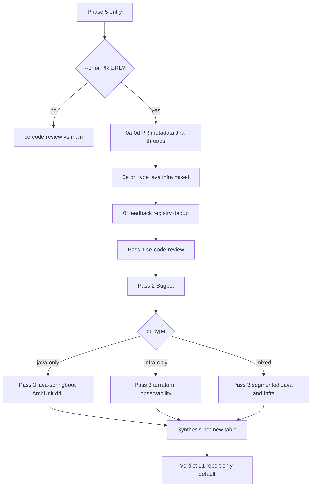
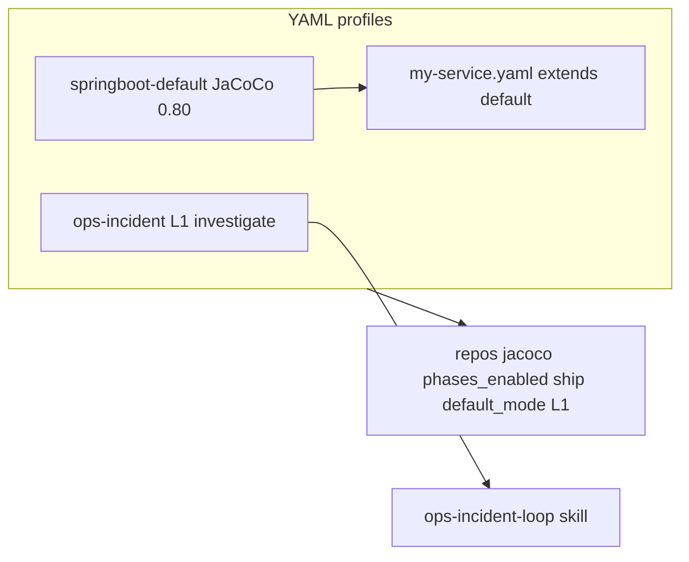
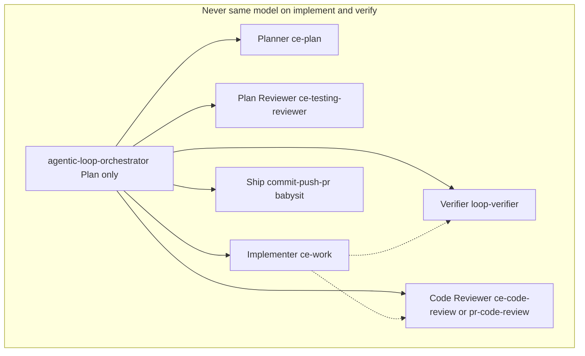
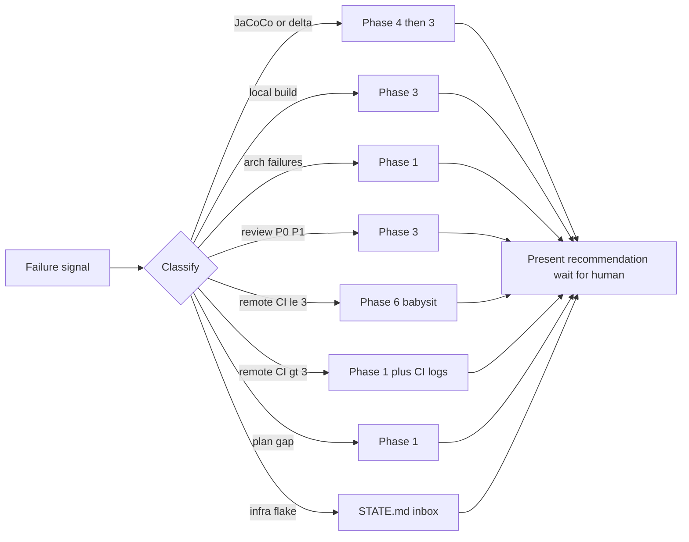

# Agentic Loop Engineering Kit

Plan-mode-first Loop Engineering OS for Java/Spring Boot monorepos.

[](LICENSE)

## What it is

- **Slash command** `/agentic-loop` — plan-mode-first; phases 0–9; **L1 default** (Phase 0→2, report-only)
- **Profiles** — YAML in `loop-kit/profiles/` (`springboot-default`, `ops-incident`; extend for your services)
- **Maker/checker** — implementer (`ce-work`) never verifies itself (`loop-verifier`); orchestrator delegates
- **Failure Router** — classifies failures and **recommends** next phase; never auto-re-dispatch
- **Seven standards** — Java, Spring Boot, quality drill, PR review, Terraform, jabrena testing rules

## Quick start

```bash
git clone https://github.com/pallerana/agentic-loop-engineering-kit.git
cd your-monorepo
cp -R agentic-loop-engineering-kit/loop-kit ./loop-kit
# merge agentic-loop-engineering-kit/.cursor into your .cursor/
cp agentic-loop-engineering-kit/LOOP.md agentic-loop-engineering-kit/STATE.md .
cp agentic-loop-engineering-kit/loop-budget.md agentic-loop-engineering-kit/loop-run-log.md .
cp agentic-loop-engineering-kit/patterns/registry.yaml ./patterns/
npx @cobusgreyling/loop-audit . --suggest
/agentic-loop --help
```

## Installation

1. **Copy or submodule** this repo into your monorepo tooling area.
2. **Merge** `loop-kit/` and `.cursor/` (commands, agents, skills, rules, hooks).
3. **Copy root loop files:** `LOOP.md`, `STATE.md`, `loop-budget.md`, `loop-run-log.md`, `patterns/registry.yaml`.
4. **Enable hooks** — `.cursor/hooks.json` (dangerous-git, denylist-edits, append-run-log).
5. **MCP** — merge `.cursor/mcp.agentic-loop.template.json` into your MCP config.
6. **Consumer profile** — add `loop-kit/profiles/my-service.yaml` extending `springboot-default`.
7. **Validate** — `npx @cobusgreyling/loop-audit . --suggest` (see below).
8. **Recommended** — bootstrap [LLM-wiki](https://github.com/Ss1024sS/LLM-wiki) and [graphify](https://github.com/safishamsi/graphify) for efficient agent behaviour.

## Recommended companion setup (efficient agent behaviour)

This kit orchestrates **what** the agent does each phase. For **durable memory** and **fast codebase navigation**, bootstrap these two projects in the same monorepo:

### [LLM-wiki](https://github.com/Ss1024sS/LLM-wiki) — compile-first project memory

Karpathy-style **wiki-first** knowledge: raw sources → compiled `docs/wiki/` → code. Stops every session from re-explaining decisions.

```bash
git clone https://github.com/Ss1024sS/LLM-wiki.git
python3 LLM-wiki/scripts/bootstrap_knowledge_system.py /path/to/your-monorepo "Your Project"
```

After bootstrap, Phase 0 reads `docs/wiki/index.md`, `current-status.md`, and `log.md`; Phase 9 writeback appends `log.md` and refreshes status. See [UNIVERSAL.md](https://github.com/Ss1024sS/LLM-wiki/blob/main/UNIVERSAL.md).

### [graphify](https://github.com/safishamsi/graphify) — queryable codebase knowledge graph

Turns repos into `graphify-out/graph.json` so agents answer architecture questions without full-tree search.

```bash
# Install graphify skill / CLI per repo README, then from monorepo root:
graphify update <repo-path>          # or graphify <path> for first build
graphify query "How does auth flow to the API?"
graphify path "Controller" "Repository"
```

Use in **Phase 0** (context sync) and **Phase 9** (update graph after code changes). Optional: merge multi-repo graphs for polyglot monorepos.

| Layer | Tool | Agent benefit |
|-------|------|----------------|
| Decisions & status | LLM-wiki | No amnesia across sessions; mandatory writeback |
| Code structure | graphify | Sub-second `query` / `path` / `explain` vs blind grep |
| Loop discipline | This kit | Plan-mode-first phases, human gates, Failure Router |

## Maturity modes (L1 · L2 · L3-push)

Every run has a **mode** (`--mode` or profile `default_mode`). Modes control how far past Phase 2 the loop may go **without** you approving in chat.

| Mode | Phases | Code / git | Typical use |
|------|--------|------------|-------------|
| **L1** (default) | 0 → 2 | **None** — report-only | Planning, PR review tables, ops hypothesis, safe pilots |
| **L2** | 0 → 5+ (draft) | Implement, verify, review; **PR draft**; you may push manually | Feature work after you approve the plan |
| **L3-push** | 0 → 7+ | L2 + squash, **push feature branch**, CI babysit (max 3 cycles); **you merge** | End-to-end ship with human merge only |

**Rules:**

- Loop **always** starts in Cursor **Plan mode** — even L2/L3 do not auto-run in Agent mode.
- **Stop after Phase 2** until you explicitly approve (e.g. “proceed with implementation” or `--mode L2` / `L3-push` with confirmation).
- **L1 + `--pr`** → Phase 5 findings table only (`pr-code-review.mdc`); no auto-fix.
- **L3-push** never force-pushes or merges to `main` — see `docs/safety.md`.

```text
L0 (loop-audit)  →  missing files; run npx @cobusgreyling/loop-audit . --suggest
L1               →  context + plan + review; STOP before implement
L2               →  implement + verify + review; PR draft
L3-push          →  push branch + babysit CI; human merges PR
```

Examples:

```text
/agentic-loop --profile springboot-default --repo services/api PROJ-123
/agentic-loop --mode L1 --profile springboot-default --repo services/api PROJ-123
/agentic-loop --mode L2 --profile springboot-default --repo services/api PROJ-123
/agentic-loop --mode L3-push --profile springboot-default --repo services/api PROJ-123
```

## Validate your setup

After copying this kit into your monorepo, run from the **repository root**:

```bash
npx @cobusgreyling/loop-audit . --suggest
```

- **`--suggest`** prints missing files and recommended fixes (do this first).
- Re-run after adding `loop-kit/profiles/<your-service>.yaml` and merging `.cursor/`.
- Target **L1** before your first `/agentic-loop` pilot; tune `loop-budget.md` per suggestions.

| Signal | Expected path (after merge) |
|--------|----------------------------|
| Loop config | `LOOP.md` (points to `loop-kit/`) |
| Human inbox | `STATE.md` |
| Budget caps | `loop-budget.md` |
| Run history | `loop-run-log.md` |
| Pattern registry | `patterns/registry.yaml` (`id: agentic-loop`) |
| Triage / verifier | `.cursor/skills/loop-triage`, `loop-verifier` |

| Score | Meaning | Next step |
|-------|---------|-----------|
| L0 | Missing loop files or skills | Follow `--suggest` output |
| L1 | Report-only ready | `/agentic-loop --mode L1 --profile springboot-default --repo <path> PROJ-123` |
| L2+ | Implement + verify wired | Human-approved L2/L3-push pilot |

Reference: [loop-engineering](https://github.com/cobusgreyling/loop-engineering) · [loop-audit](https://www.npmjs.com/package/@cobusgreyling/loop-audit)

## Usage

| Goal | Command |
|------|---------|
| Help | /agentic-loop --help |
| L1 plan | /agentic-loop --profile springboot-default --repo services/api PROJ-123 |
| PR review | /agentic-loop --mode L1 --pr 42 |
| Ops | /agentic-loop --profile ops-incident --pagerduty INC-ABC |

## Full HELP

```
Agentic Loop Engineering Kit — plan-mode-first Loop OS for Java/Spring Boot repos

USAGE
  /agentic-loop --help
  /agentic-loop --profile <id> [options] [target]

PROFILES (shipped)
  springboot-default   Any Java/Spring Boot repo (Gradle); requires --repo
  ops-incident         Datadog / PagerDuty investigation (L1 default)

MODES
  L1        Phase 0→2, report-only, no code/git (DEFAULT)
  L2        Implement + review; PR draft; human may push
  L3-push   L2 + push feature branch + CI babysit (max 3); human merge

OPTIONS
  --profile <id>         Required except --help
  --mode L1|L2|L3-push   Override profile default
  --repo <path>          Repo under workspace (springboot-default)
  --handoff <profile>    Ops→feature handoff
  --from-state <path>    Resume from loop-kit/*-state.md
  --phase <n|name>       Start at phase
  --dry-run              Print plan; no writes
  --help                 This reference

TARGET
  <JIRA-KEY>             e.g. PROJ-123
  --datadog-monitor <id>
  --pagerduty <id>
  --pr <n>               PR review or hygiene (with --phase)

PR REVIEW (Phase 5 @pr-code-review when --pr or PR URL)
  Default L1 report-only; pr_type java|infra|mixed; Phase 0f dedup

PHASES 0–9
  0 Context · 0b Ack · 1 Plan · 2 Review · 3 Implement · 4 Verify
  5 Review · 6 Ship · 7 Hygiene · 8 Close-loop · 9 Compound

FAILURE ROUTER (recommend only)
  coverage→4→3 · local CI→3 · remote CI→6 (max 3)→1 · plan gap→1 · flake→STATE

EXAMPLES
  /agentic-loop --profile springboot-default --repo services/api PROJ-123
  /agentic-loop --mode L1 --pr https://github.com/<org>/<repo>/pull/42
  /agentic-loop --profile ops-incident --pagerduty INC-ABC
  /agentic-loop --profile springboot-default --phase 7 --pr 42

FILES
  Command    .cursor/commands/agentic-loop.md
  Runbook    .cursor/skills/agentic-loop/SKILL.md
  HELP       docs/HELP.md
  Gates      loop-kit/GATES.md
  Standards  .cursor/rules/*.mdc
```

## Standards index

| Rule | When | Phase |
|------|------|-------|
| java-springboot-standards.mdc | Java/Spring Boot code | 3, 4, 5 |
| service-quality-drill.mdc | Build, JaCoCo, CI | 4, 6, 7 |
| pr-code-review.mdc | PR review target | 5 |
| terraform-standards.mdc | Infra / mixed PRs | 5 |
| jabrena-302/311/312 | Test design | 1, 2, 4 |

Verify rules:

```bash
find .cursor/rules -name '*.mdc' | sort
test "$(find .cursor/rules -name '*.mdc' | wc -l | tr -d ' ')" -eq 7
```

## Folder structure

```text
agentic-loop-engineering-kit/
├── README.md
├── LICENSE
├── LOOP.md
├── STATE.md
├── loop-budget.md
├── loop-run-log.md
├── docs/
│   ├── HELP.md
│   ├── safety.md
│   └── standards/
│       └── README.md
├── loop-kit/
│   ├── ARCHITECTURE.md
│   ├── LOOP.md
│   ├── GATES.md
│   ├── STATE.md
│   ├── loop-budget.md
│   ├── loop-run-log.md
│   ├── feature-state.md
│   ├── ops-incident-state.md
│   ├── patterns/feature-loop-example.md
│   └── profiles/
│       ├── README.md
│       ├── springboot-default.yaml
│       └── ops-incident.yaml
├── patterns/registry.yaml
└── .cursor/
    ├── commands/agentic-loop.md
    ├── agents/
    │   ├── agentic-loop-orchestrator.md
    │   └── loop-verifier.md
    ├── skills/
    │   ├── agentic-loop/SKILL.md + scripts/ (6)
    │   ├── loop-triage/SKILL.md
    │   ├── loop-verifier/SKILL.md
    │   ├── loop-budget/SKILL.md
    │   └── ops-incident-loop/SKILL.md
    ├── rules/
    │   ├── java-springboot-standards.mdc
    │   ├── service-quality-drill.mdc
    │   ├── pr-code-review.mdc
    │   ├── terraform-standards.mdc
    │   └── external/jabrena-302|311|312*.mdc
    ├── hooks.json + hooks/*.sh
    └── mcp.agentic-loop.template.json
```

## Architecture

### Diagram 1 — System layers



### Diagram 2 — Invocation routing



### Diagram 3 — Phase machine



### Diagram 4 — Phase 5 PR branch



### Diagram 5 — Profile model



### Diagram 6 — Maker checker split



### Diagram 7 — Failure Router



## Profiles

- springboot-default — Gradle Java/Spring Boot; requires --repo
- ops-incident — Datadog/PagerDuty L1 investigation
- Extend with loop-kit/profiles/my-service.yaml

## External dependencies

| Dependency | Role |
|------------|------|
| [Compound Engineering](https://github.com/compound-engineering) | `ce-plan`, `ce-work`, `ce-code-review`, `ce-compound` |
| [loop-engineering](https://github.com/cobusgreyling/loop-engineering) + [loop-audit](https://www.npmjs.com/package/@cobusgreyling/loop-audit) | L0→L1 readiness scoring |
| [LLM-wiki](https://github.com/Ss1024sS/LLM-wiki) | Wiki-first memory (Phase 0 / 9) — **recommended** |
| [graphify](https://github.com/safishamsi/graphify) | Codebase knowledge graph (Phase 0 / 9) — **recommended** |
| Cursor MCP | Atlassian, GitHub, Datadog, PagerDuty (per profile) |

## License

Apache-2.0 — see LICENSE.
