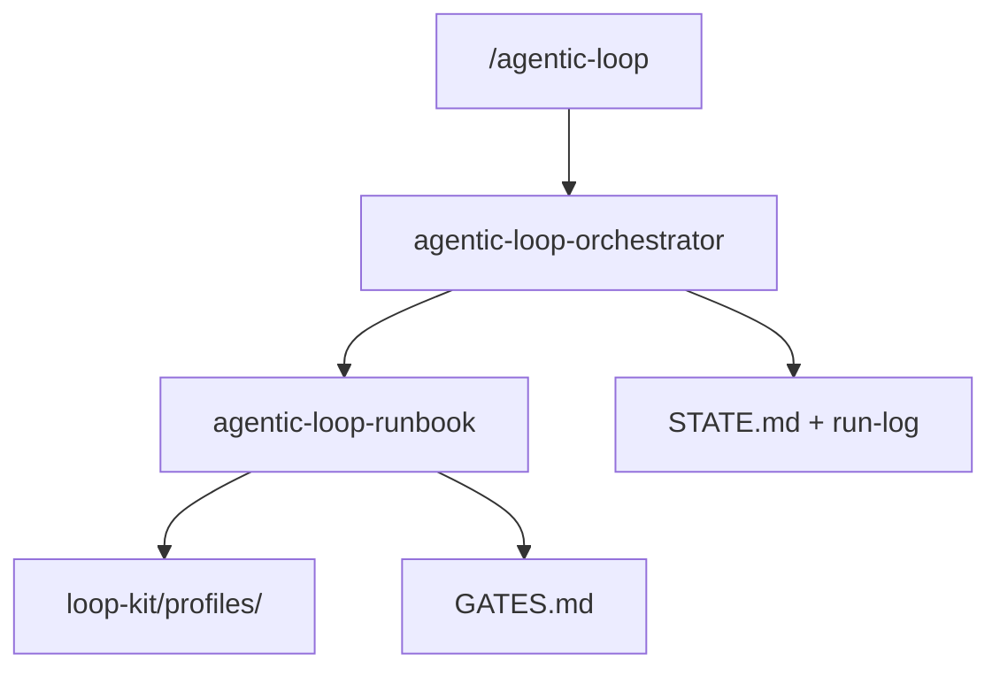
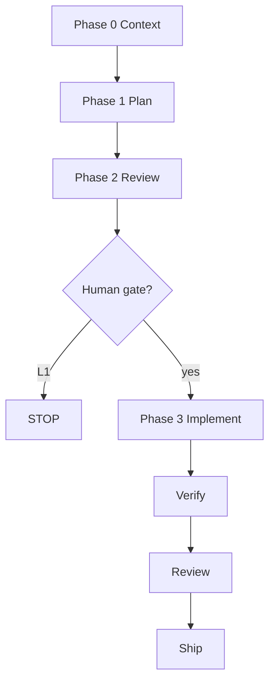
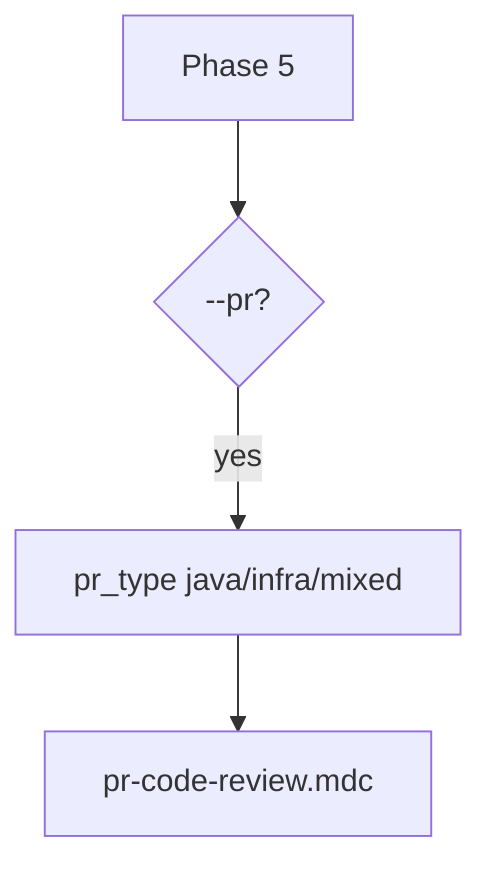

# Agentic Loop Engineering Kit

Plan-mode-first Loop Engineering OS for Java/Spring Boot monorepos.

[](LICENSE)

## What it is

- Slash command `/agentic-loop` — always starts in Plan mode (L1 default)
- YAML profiles in `loop-kit/profiles/`
- Seven Cursor rules under `.cursor/rules/`
- Human gates before implement, verify, or ship
- Failure Router recommends next phase only

## Quick start

```bash
git clone https://github.com/pallerana/agentic-loop-engineering-kit.git
cd your-monorepo
cp -R agentic-loop-engineering-kit/loop-kit ./loop-kit
# merge agentic-loop-engineering-kit/.cursor into your .cursor/
cp agentic-loop-engineering-kit/LOOP.md agentic-loop-engineering-kit/STATE.md .
cp agentic-loop-engineering-kit/loop-budget.md agentic-loop-engineering-kit/loop-run-log.md .
cp agentic-loop-engineering-kit/patterns/registry.yaml ./patterns/
npx @cobusgreyling/loop-audit . --suggest
/agentic-loop --help
```

## Validate your setup

```bash
npx @cobusgreyling/loop-audit . --suggest
```

Reference: [loop-engineering](https://github.com/cobusgreyling/loop-engineering) · [loop-audit](https://www.npmjs.com/package/@cobusgreyling/loop-audit)

## Usage

| Goal | Command |
|------|---------|
| Help | /agentic-loop --help |
| L1 plan | /agentic-loop --profile springboot-default --repo services/api PROJ-123 |
| PR review | /agentic-loop --mode L1 --pr 42 |
| Ops | /agentic-loop --profile ops-incident --pagerduty INC-ABC |

## Full HELP

```
Agentic Loop Engineering Kit — plan-mode-first Loop OS for Java/Spring Boot repos

USAGE
  /agentic-loop --help
  /agentic-loop --profile <id> [options] [target]

PROFILES (shipped)
  springboot-default   Any Java/Spring Boot repo (Gradle); requires --repo
  ops-incident         Datadog / PagerDuty investigation (L1 default)

MODES
  L1        Phase 0→2, report-only, no code/git (DEFAULT)
  L2        Implement + review; PR draft; human may push
  L3-push   L2 + push feature branch + CI babysit (max 3); human merge

OPTIONS
  --profile <id>         Required except --help
  --mode L1|L2|L3-push   Override profile default
  --repo <path>          Repo under workspace (springboot-default)
  --handoff <profile>    Ops→feature handoff
  --from-state <path>    Resume from loop-kit/*-state.md
  --phase <n|name>       Start at phase
  --dry-run              Print plan; no writes
  --help                 This reference

TARGET
  <JIRA-KEY>             e.g. PROJ-123
  --datadog-monitor <id>
  --pagerduty <id>
  --pr <n>               PR review or hygiene (with --phase)

PR REVIEW (Phase 5 @pr-code-review when --pr or PR URL)
  Default L1 report-only; pr_type java|infra|mixed; Phase 0f dedup

PHASES 0–9
  0 Context · 0b Ack · 1 Plan · 2 Review · 3 Implement · 4 Verify
  5 Review · 6 Ship · 7 Hygiene · 8 Close-loop · 9 Compound

FAILURE ROUTER (recommend only)
  coverage→4→3 · local CI→3 · remote CI→6 (max 3)→1 · plan gap→1 · flake→STATE

EXAMPLES
  /agentic-loop --profile springboot-default --repo services/api PROJ-123
  /agentic-loop --mode L1 --pr https://github.com/<org>/<repo>/pull/42
  /agentic-loop --profile ops-incident --pagerduty INC-ABC
  /agentic-loop --profile springboot-default --phase 7 --pr 42

FILES
  Command    .cursor/commands/agentic-loop.md
  Runbook    .cursor/skills/agentic-loop/SKILL.md
  HELP       docs/HELP.md
  Gates      loop-kit/GATES.md
  Standards  .cursor/rules/*.mdc
```

## Standards index

| Rule | When | Phase |
|------|------|-------|
| java-springboot-standards.mdc | Java/Spring Boot code | 3, 4, 5 |
| service-quality-drill.mdc | Build, JaCoCo, CI | 4, 6, 7 |
| pr-code-review.mdc | PR review target | 5 |
| terraform-standards.mdc | Infra / mixed PRs | 5 |
| jabrena-302/311/312 | Test design | 1, 2, 4 |

Verify rules:

```bash
find .cursor/rules -name '*.mdc' | sort
test "$(find .cursor/rules -name '*.mdc' | wc -l | tr -d ' ')" -eq 7
```

## Folder structure

```
agentic-loop-engineering-kit/
├── README.md, LICENSE, LOOP.md, STATE.md, loop-budget.md, loop-run-log.md
├── docs/HELP.md, docs/safety.md, docs/standards/README.md
├── loop-kit/ (GATES, LOOP, profiles, state templates)
├── patterns/registry.yaml
└── .cursor/ (commands, agents, skills, rules, hooks, MCP template)
```

## Architecture

### System layers



### Phase machine



### PR review routing



## Profiles

- springboot-default — Gradle Java/Spring Boot; requires --repo
- ops-incident — Datadog/PagerDuty L1 investigation
- Extend with loop-kit/profiles/my-service.yaml

## External dependencies

Compound Engineering Cursor plugin, loop-engineering, Cursor MCP (Atlassian, GitHub, Datadog, PagerDuty).

## License

Apache-2.0 — see LICENSE.
